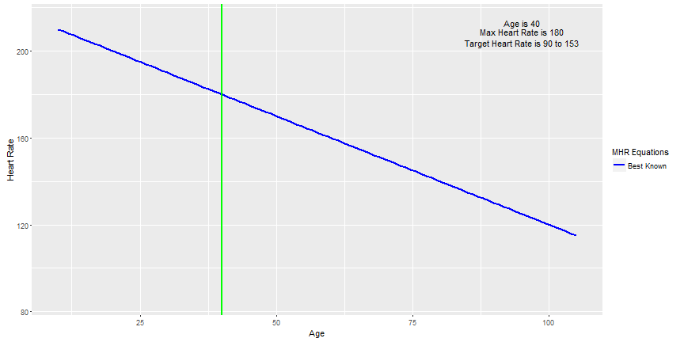

## Maximum Heart Rate

1. As human beings age their maximum heart rate decreases.  
2. The Center for Desiese Control states that the percentage of Americans engaged in Leisure-time physical activity has increased in the past 15 years from 42% to 48% of the population.
3. As more people engage in physical activity and the intensity of physical activity increases its important for this growing population to understand the how the heart responds to physical activity over time. 
4. It is also important for these people to know their maximum heart rate and their workout heart rate target zone.  
5. Working out in the heart rate target zone helps the participants to maximize their benefit from the time spent working out. 
6. The workout heart rate target zone is 50% to 85% of the Maximum Heart Rate

---

## Chart of Maximum Heart Rate at Age 40

The chart below uses the best known Maximum Heart Rate calculator of 220 minus the participant's age.  
This chart is calculated for a 40 year old.  The workout heart rate target zone is also calculated. 

---

## Maximum Heart Rate Equations

1. The best known Maximum Heart Rate equation is 220 - your age.
2. Over time numerous experiments have been performed in an attempt to better understand the age releated Maximum Heart Rate and to more percisely determine the age related maximum heart rate.
3. There is variability in the resultant Maximum Heart Rate equation from experiment to experiment.  
4. In an effort to have a more comprehensive understanding of the potential Maximum Heart Rate people should consider reviewing several Maximum Heart Rate equations.

---

## Maximum Heart Rate Calculator

1. To see a variety of Maximum Heart Rate calculators, the upper and lower Maximum Heart Rate calculators and their associated workout heart rate target zones access the Interactive Maximum Heart Rate Calculator

The Maximum Heart Rate Calculator can be found here:   
[Interactive Maximum Heart Rate Calculator](https://thurstont.shinyapps.io/MHR1/ "DDP Class Project")
  
  
  
  
* Enjoy your workouts and keep your heart in the workout heart rate target zone for best results from your workout.

* Before initiating a new workout program consult your physician for professional medical advice for your specific situation. 

